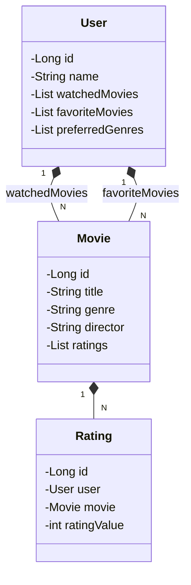

# 🎬 Sistema de recomendação de filmes

Este é um projeto de sistema de recomendação de filmes desenvolvido em Java 17 com Spring Boot 3. A API RESTful permite recomendações personalizadas com base nas preferências do usuário e avaliações de filmes.

## 🚀 Principais Tecnologias
- **Java 17**: Utilizamos a versão LTS mais recente do Java para aproveitar as inovações mais recentes em uma linguagem robusta e amplamente adotada.
- **Spring Boot 3**: Trabalhamos com a mais nova versão do Spring Boot, maximizando a produtividade do desenvolvedor com suas avançadas funcionalidades de autoconfiguração.
- **Spring Data JPA**: Simplificamos o acesso aos dados e facilitamos a integração com bancos de dados SQL.
- **OpenAPI (Swagger)**: Criamos uma documentação de API clara e eficaz usando OpenAPI (Swagger), garantindo uma interface amigável e produtiva.
- **Railway**: Facilitamos o deploy e monitoramento das soluções na nuvem, além de oferecer diversos bancos de dados como serviço e pipelines de CI/CD.

### 📊 Diagrama de Classes

